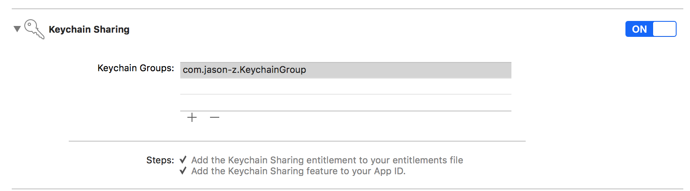

# cordova-plugin-keychain-uuid

get iOS unique device id by **KEYCHAIN+UUID**,

you can also choose another way : [KEYCHAIN+IDFA](https://github.com/jasonz1987/cordova-plugin-keychain-idfa)

more info visit：http://www.jason-z.com/post/22


[中文文档](REAEDME_CN.md)


# Example


[Ionic3 Demo](https://github.com/jasonz1987/ionic-keychain-uuid-demo)


# Install

```bash
cordova plugin add cordova-plugin-keychain-uuid
```


# Usage


### get device id from keychain

```javascript
var args = {
  'key':'com.jason-z.test.uuid'
};

KeychainUUID.getDeviceID((id)=>{
 console.log(id);   
},(err)=>{
    console.log(err);
})
```


###  delete device id from keychain

```javascript
var args = {
  'key':'com.jason-z.test.uuid'
};

KeychainUUID.deleteDeviceID((id)=>{
 console.log(id);   
},(err)=>{
    console.log(err);
})
```

*you can custom **key** value by your own.*


# Warning

the keychain data are stored privately by default. if you want share your data in different app (in same account),you must open `KEYCHAIN_SHARE`. you can do it by these steps.

open `Xcode->Capabilities->Keychain Sharing`, then add same group in your apps.




# Donate

If this project help you reduce time to develop, you can give me a cup of coffee :)


[](https://www.paypal.me/jasonz1987/6.66)

